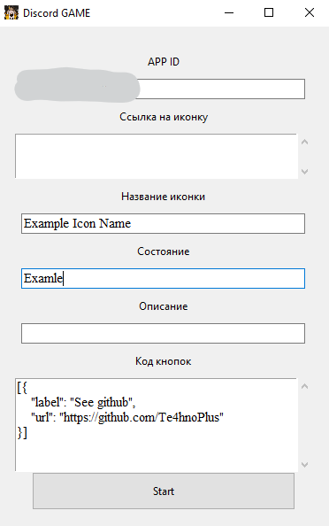

## Подготовка

Установи `Python`, приложение разрабатывалось и тестировалось на версии `3.12.6`
Установи `pypresence` (Введи в консоль команду `pip install pypresence`)

## Запуск
Запусти `main.pyw` или `start_dsvi.bat`, если необходима консоль

## Работа

Просто скопируй ID приложения, имя которого ты хочешь использовать, и нажми Start

## Возможные ошибки и недочеты

1) У некоторых пользователей может не работать вставка из буффера обмена, во время использования русской раскладки

2) Рекомендуется самостоятельно следить за правильностью ввода данных